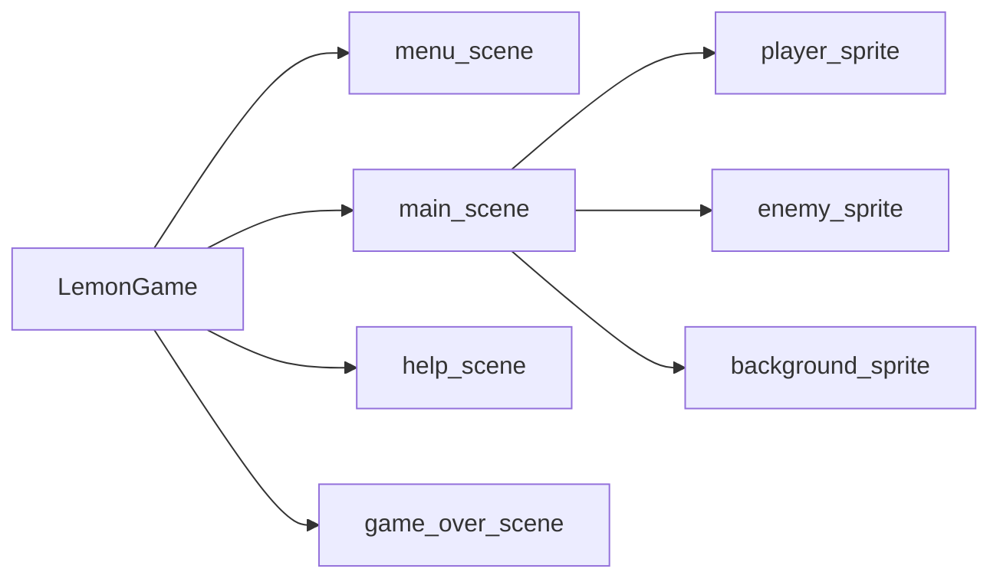
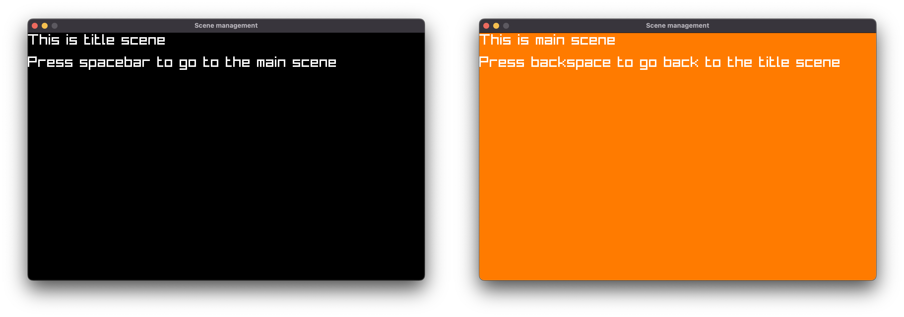

# Scene management

Games usually have different scenes serving different purpose.
For example, loading scene, menu scene, game over scene, etc.
Different level/labyrinth/dungeon can also be separated in different scene. 

## Anatomy of Lemon games

For easier scene management, Lemon proposes following structure:



A Lemon game may consist of different scenes, each scene independently holds its own states and objects.
There are two reserved functions for each scene: `on_load()` and `on_update(dt)`.
Menu scene has its own updating logic inside `on_update(dt)` to accept keyboard input to choose game menu, and main game scene also has its own updating logic to handle character movement and enemy spawning.

It is easy to switch scene in Lemon.
Consider this project structure, with two scenes:

```
scene management/
├── game.json
├── main_scene.lua
└── title_scene.lua
```

- The `game.json`:
  
  ```
  asd
  ```

- The `title_scene.lua`:
  
  ```lua
  function on_update(dt)
      L.draw_rect_fill(
          0,
          0,
          L.get_screen_width(),
          L.get_screen_height(),
          L.rgba(0, 0, 0, 255)
      )

      L.draw_text(
          "This is title scene\n" ..
          "Press spacebar to go to the main scene",
          0,
          0,
          30,
          L.rgba(255, 255, 255, 255)
      )

      if L.is_key_pressed(L.KEY_SPACE) then
          L.set_scene("main_scene")
      end
  end

  ```

- The `main_scene.lua`:

  ```lua
  function on_update(dt)
      L.draw_rect_fill(
          0,
          0,
          L.get_screen_width(),
          L.get_screen_height(),
          L.rgba(255, 123, 0, 255)
      )

      L.draw_text(
          "This is main scene\n" ..
          "Press backspace to go back to the title scene",
          0,
          0,
          30,
          L.rgba(255, 255, 255, 255)
      )

      if L.is_key_pressed(L.KEY_BACKSPACE) then
          L.set_scene("title_scene")
      end
  end

  ```

> Yes, there is no `on_load()` function.
> It is okay, since we have nothing to initialize.

We can now switch screens by space/backspace key:
